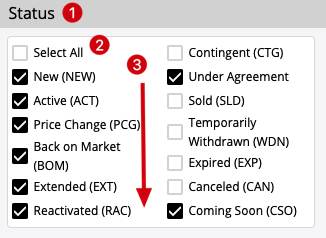

TypeScript React Multi-Check Testing Program

## Demo



1. The component has a label
2. The special `Select All` option
   1. if checked, all other options are checked
   2. if unchecked, all other options are unchecked
   3. if all other options are checked, it should be checked
   4. if any other option are unchecked, it should be unchecked
3. The options support multiple-columns, and the direction is from top to bottom in each column

### The layout example

Suppose

```
options =  ['aaa', 'bbb', 'ccc', 'ddd', 'eee', 'fff'] 
columns = 3
```

There are seveal posibilities:

1. not preferred
```
Select All   ccc      fff
aaa          ddd
bbb          eee
```

2. preferred
```
Select All   ccc       eee
aaa          ddd       fff
bbb           
```

Make the column sizes as even as possible, and put extra options in the first several columns, and also make them even,
so the 2nd solution is preferred.

## Dev

```
npm install
npm run dev
```

## Test

```
npm test
```